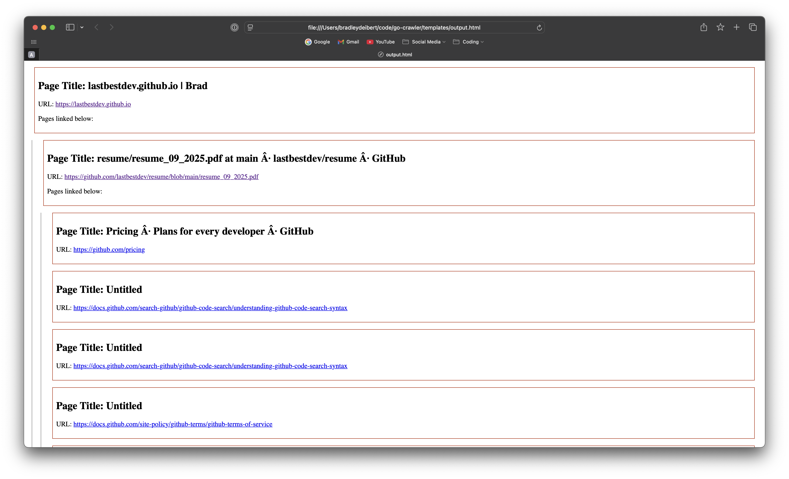

# go-crawler
a basic web crawler written in go. works on the command line.

### features 
- recursively crawls webpages by following anchor tags (links) found in the HTML source, until specified `searchDepth` is reached (i.e. # of links followed away from the seed URL)
- fetch and parse `robots.txt` files to comply with crawler rules (follow User-agent: * guidelines)
- builds a search tree of visted pages while crawling, and outputs to viewable `output.html`

### limitations 
- no persistence (database). every run is completed in memory, from scratch. 
- does not execute javascript. the crawler fetches/reads static content served on initial page load (unable to read dynamically populated page content. ex. SPA applications without SSR)

## how to use
### running the crawler
a `seed URL` is required for the crawler to begin a search from. this URL is provided by the user as a command line argument. 

optionally, the `-n` flag is provided to specify a `searchDepth`. this parameter determines how far the crawler will recursively follow links from the seed URL. possible values are `1-5`, the default `searchDepth` is 3. 

for example, the following run will build a search tree of all links found on `google.com` and its child pages (up to a depth of 5):
```
go run . -n 5 https://www.google.com
```

once processing has finished, the search tree (all visited websites) is written to an `output.html` file you can open in your web browser:

```
open templates/output.html
```

## example 
**input**: `go run . -n 2 https://lastbestdev.github.io`

**output**: 

